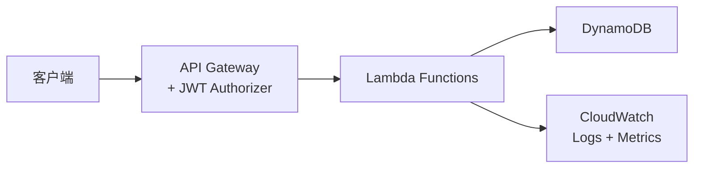

# Architecture: Hotel Booking Inventory API

> 预填版本 — Workshop 应急使用

## 系统上下文



## 技术栈

| 组件 | 技术 | 说明 |
|------|------|------|
| Runtime | Node.js 20 + TypeScript | Lambda 运行时 |
| API Layer | API Gateway REST | 路由 + JWT 认证 |
| Compute | AWS Lambda | 按请求付费 |
| Database | DynamoDB | 单表设计 |
| Validation | Zod | 请求体校验 |
| IaC | AWS CDK v2 | TypeScript 定义 |
| Testing | Jest + supertest | 单元 + E2E |
| Monitoring | CloudWatch + X-Ray | 日志 + 追踪 |

## DynamoDB 单表设计

所有实体共用一张表，PK 统一用 `HOTEL#<hotelId>` 前缀实现数据隔离，SK 前缀区分实体类型，使同一分区内多实体共存，所有查询均可用 Query（而非 Scan）高效完成。

| 实体 | PK | SK | 属性 |
|------|----|----|------|
| Room | `HOTEL#<hotelId>` | `ROOM#<roomId>` | type, name, capacity, price, status, amenities, archivedAt |
| Booking | `HOTEL#<hotelId>` | `BOOKING#<date>#<roomId>` | guestId, checkIn, checkOut, status |
| Availability | `HOTEL#<hotelId>` | `AVAIL#<date>` | available (boolean), bookedBy |

### 访问模式

| 操作 | PK | SK 条件 | 说明 |
|------|----|----|------|
| 获取房间 | `HOTEL#<hotelId>` | `ROOM#<roomId>` | GetItem |
| 列出酒店所有房间 | `HOTEL#<hotelId>` | `begins_with(ROOM#)` | Query |
| 按日期范围查询预订 | `HOTEL#<hotelId>` | `between(BOOKING#startDate, BOOKING#endDate)` | Query |
| 按日期查询可用性 | `HOTEL#<hotelId>` | `between(AVAIL#startDate, AVAIL#endDate)` | Query |

## 项目结构

```
hotel-booking-api/
├── src/
│   ├── handlers/
│   │   ├── create-room.ts
│   │   ├── get-room.ts
│   │   ├── list-rooms.ts
│   │   ├── update-room.ts
│   │   ├── archive-room.ts
│   │   └── check-availability.ts
│   ├── schemas/
│   │   ├── room.schema.ts
│   │   └── availability.schema.ts
│   ├── services/
│   │   └── dynamodb.service.ts
│   ├── utils/
│   │   ├── response.ts
│   │   └── errors.ts
│   └── __tests__/
│       ├── unit/
│       │   ├── create-room.test.ts
│       │   └── get-room.test.ts
│       └── e2e/
│           └── api.test.ts
├── src/infra/
│   ├── bin/app.ts
│   └── lib/
│       ├── api-stack.ts
│       ├── database-stack.ts
│       └── monitoring-stack.ts
├── package.json
├── tsconfig.json
├── jest.config.ts
└── cdk.json
```

## API Gateway 路由

| Method | Path | Handler | Auth |
|--------|------|---------|------|
| POST | /api/v1/rooms | create-room | JWT Required |
| GET | /api/v1/rooms/{id} | get-room | JWT Required |
| GET | /api/v1/rooms | list-rooms（支持 status/type 筛选） | JWT Required |
| PUT | /api/v1/rooms/{id} | update-room | JWT Required |
| GET | /api/v1/rooms/availability | check-availability（按日期范围） | JWT Required |
| DELETE | /api/v1/rooms/{id} | archive-room（软删除，可选端点） | JWT Required |

## 错误处理

所有 Lambda 统一使用 `response.ts` 工具函数：

```typescript
// 成功
return success(201, { id, ...roomData });

// 错误
return error(400, 'VALIDATION_ERROR', 'Invalid room type');
return error(401, 'UNAUTHORIZED', 'Token expired');
return error(404, 'NOT_FOUND', 'Room not found');           // 房间从未存在
return error(410, 'GONE', 'Room archived', { archivedAt }); // 房间已归档（软删除）
return error(500, 'INTERNAL_ERROR', 'Unexpected error');
```

**软删除（归档）语义：** `DELETE /rooms/{id}` 不物理删除数据项，而是把 `status` 置为 `archived` 并写入 `archivedAt` 时间戳。后续 `GET` 命中 archived 记录时返回 **410 Gone**（附 archivedAt），命中不存在的 id 时返回 404。这样保留了归档审计信息，也让"删除"语义在 PRD、架构、测试三方对齐。

## CDK 关键设计决策

| 决策 | 做法 | 原因 |
|------|------|------|
| 最小权限授权 | 用 `table.grantWriteData(fn)` / `grantReadData(fn)`，**禁止 `grantFullAccess`** | 每个 Lambda 只拿它需要的权限 |
| 独立 IAM Role | 每个 Lambda 独立的 IAM Role | 避免权限累积、便于审计 |
| 数据保护 | DynamoDB `pointInTimeRecovery: true` | 启用时间点恢复，防数据丢失 |
| 防误删 | DynamoDB `removalPolicy: RETAIN` | 防止 `cdk destroy` 意外删除生产数据 |
| 计费模式 | `billingMode: PAY_PER_REQUEST` | 按需计费，匹配 Workshop/MVP 流量 |
| 可观测性 | Lambda `tracing: ACTIVE`（X-Ray）+ API Gateway `tracingEnabled` | 端到端追踪 |

```typescript
// 示例：最小权限 + 数据保护
const table = new dynamodb.Table(this, 'HotelTable', {
  partitionKey: { name: 'PK', type: dynamodb.AttributeType.STRING },
  sortKey: { name: 'SK', type: dynamodb.AttributeType.STRING },
  billingMode: dynamodb.BillingMode.PAY_PER_REQUEST,
  removalPolicy: cdk.RemovalPolicy.RETAIN,
  pointInTimeRecovery: true,
});
table.grantWriteData(createRoomFn);  // 仅授予写权限，非 grantFullAccess
```

## 安全

- JWT via Lambda Authorizer (RS256)
- IAM: 每个 Lambda 独立 Role，仅授予所需的 DynamoDB 操作（用 `grantWriteData`/`grantReadData`，禁止 `grantFullAccess`）
- 无硬编码密钥，使用 SSM Parameter Store
- 输入清理：Zod schema 验证所有用户输入

## 监控告警

| 告警 | 阈值 | 动作 |
|------|------|------|
| 5xx 错误率 | > 1% 持续 5 分钟 | SNS → 邮件 |
| P95 延迟 | > 500ms 持续 5 分钟 | SNS → 邮件 |
| DynamoDB 限流 | > 0 | SNS → 邮件 |
