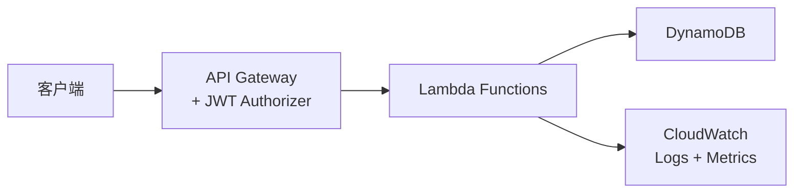

# Architecture: Hotel Booking Inventory API

> 预填版本 — Workshop 应急使用

## 系统上下文



## 技术栈

| 组件 | 技术 | 说明 |
|------|------|------|
| Runtime | Node.js 20 + TypeScript | Lambda 运行时 |
| API Layer | API Gateway REST | 路由 + JWT 认证 |
| Compute | AWS Lambda | 按请求付费 |
| Database | DynamoDB | 单表设计 |
| Validation | Zod | 请求体校验 |
| IaC | AWS CDK v2 | TypeScript 定义 |
| Testing | Jest + supertest | 单元 + E2E |
| Monitoring | CloudWatch + X-Ray | 日志 + 追踪 |

## DynamoDB 单表设计

| 实体 | PK | SK | 属性 |
|------|----|----|------|
| Room | `HOTEL#<hotelId>` | `ROOM#<roomId>` | type, name, capacity, price, status, amenities |
| Availability | `ROOM#<roomId>` | `AVAIL#<date>` | available (boolean), bookedBy |

### 访问模式

| 操作 | PK | SK 条件 | 说明 |
|------|----|----|------|
| 获取房间 | `HOTEL#<hotelId>` | `ROOM#<roomId>` | GetItem |
| 列出酒店所有房间 | `HOTEL#<hotelId>` | `begins_with(ROOM#)` | Query |
| 查询可用性 | `ROOM#<roomId>` | `between(AVAIL#startDate, AVAIL#endDate)` | Query |

## 项目结构

```
hotel-booking-api/
├── src/
│   ├── handlers/
│   │   ├── create-room.ts
│   │   ├── get-room.ts
│   │   ├── list-rooms.ts
│   │   └── check-availability.ts
│   ├── schemas/
│   │   ├── room.schema.ts
│   │   └── availability.schema.ts
│   ├── services/
│   │   └── dynamodb.service.ts
│   ├── utils/
│   │   ├── response.ts
│   │   └── errors.ts
│   └── __tests__/
│       ├── unit/
│       │   ├── create-room.test.ts
│       │   └── get-room.test.ts
│       └── e2e/
│           └── api.test.ts
├── src/infra/
│   ├── bin/app.ts
│   └── lib/
│       ├── api-stack.ts
│       ├── database-stack.ts
│       └── monitoring-stack.ts
├── package.json
├── tsconfig.json
├── jest.config.ts
└── cdk.json
```

## API Gateway 路由

| Method | Path | Handler | Auth |
|--------|------|---------|------|
| POST | /api/v1/rooms | create-room | JWT Required |
| GET | /api/v1/rooms/{id} | get-room | JWT Required |
| GET | /api/v1/rooms | list-rooms | JWT Required |
| GET | /api/v1/rooms/{id}/availability | check-availability | JWT Required |

## 错误处理

所有 Lambda 统一使用 `response.ts` 工具函数：

```typescript
// 成功
return success(201, { id, ...roomData });

// 错误
return error(400, 'VALIDATION_ERROR', 'Invalid room type');
return error(401, 'UNAUTHORIZED', 'Token expired');
return error(404, 'NOT_FOUND', 'Room not found');
return error(500, 'INTERNAL_ERROR', 'Unexpected error');
```

## 安全

- JWT via Lambda Authorizer (RS256)
- IAM: Lambda 只有 DynamoDB 表级权限 (GetItem, PutItem, Query)
- 无硬编码密钥，使用 SSM Parameter Store
- 输入清理：Zod schema 验证所有用户输入

## 监控告警

| 告警 | 阈值 | 动作 |
|------|------|------|
| 5xx 错误率 | > 1% 持续 5 分钟 | SNS → 邮件 |
| P95 延迟 | > 500ms 持续 5 分钟 | SNS → 邮件 |
| DynamoDB 限流 | > 0 | SNS → 邮件 |
