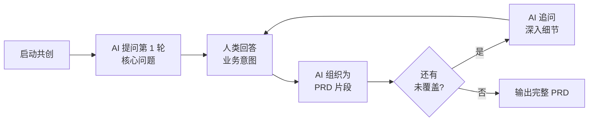

# PRD 共创对话模式指南

> 适用版本：BMAD Method v6.8+ | 最后验证日期：2026-06-03

## 什么是 PRD 共创模式？

传统方式：人写完整 Prompt → AI 一次性输出 PRD
共创方式：AI 边问边组织 → 人边答边确认 → PRD 渐进式成型



## 如何启动

### 方式 1：直接告诉 PM Agent 使用共创模式

```
/bmad-agent-pm
```

然后输入：

```
我想用对话模式来创建 PRD。不要一次性输出完整文档。
请一个问题一个问题地问我，每轮最多问 3 个问题。
根据我的回答逐步组织成 PRD 结构。
当你认为信息足够时，输出完整 PRD 让我确认。

项目背景：[简要描述你想做什么]
```

### 方式 2：Workshop Seed Prompt（快捷版）

```
CP

请以"PRD 共创"模式工作：
1. 先问我 3 个关于产品目标和用户的问题
2. 根据回答追问技术约束和验收标准
3. 每收到回答就实时更新 PRD 大纲（用代码块展示当前结构）
4. 最多 5 轮对话后输出完整 PRD

项目：为现有酒店预订 API 添加预订管理功能
已有系统：见 _bmad-output/planning-artifacts/project-context.md
```

## AI 提问的典型轮次

### 第 1 轮：业务意图（WHY + WHO）
AI 通常会问：
- "这个功能要解决什么业务问题？"
- "主要用户是谁？他们的核心场景是什么？"
- "成功的衡量标准是什么？"

### 第 2 轮：范围界定（WHAT）
- "你提到的 X 功能，具体包含哪些操作？"
- "MVP 必须包含什么？哪些可以后期做？"
- "有什么明确不做的事情？"

### 第 3 轮：技术约束（HOW - 边界）
- "需要与现有哪些系统集成？"
- "性能/安全有硬性要求吗？"
- "数据存储有偏好或限制吗？"

### 第 4 轮：验收标准（DONE）
- "如何判断每个功能完成了？"
- "有哪些边界情况需要处理？"
- "是否有特定的错误处理要求？"

### 第 5 轮：确认与输出
- AI 展示完整 PRD 结构，请你确认或修改

## 对比两种方式

| 维度 | 一次性 Prompt | 共创对话模式 |
|------|-------------|-------------|
| 适合场景 | 需求已非常清晰，想节省时间 | 需求模糊，需要被引导思考 |
| 输出质量 | 取决于 Prompt 完整度 | 通常更高，因为 AI 主动发现遗漏 |
| 耗时 | 更短（如果 Prompt 写得好） | 稍长（5-10 分钟对话） |
| 学习效果 | 低（复制粘贴） | 高（理解 PRD 各部分为什么重要） |
| Workshop 推荐 | 时间紧张时用 Seed Prompt | 首次体验时用共创模式理解流程 |

## Workshop 中的建议用法

1. **首次体验（如有时间）** — 用共创模式做一个完整 PRD，理解每个维度的意义
2. **时间紧张** — 直接用 Seed Prompt，重点放在评审和修改上
3. **Brownfield 场景特别适合** — AI 可以基于已有代码提出更精准的问题

## 注意事项

- 共创模式下，让 AI 每轮最多问 3 个问题，避免信息过载
- 如果 AI 问的问题你答不上来，直接说"不确定"或"你建议呢"
- AI 应在每轮回答后展示当前 PRD 大纲的变化
